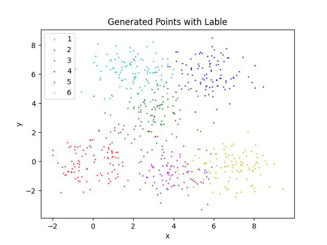

# ML-clustering

用于 2024 年春人工智能基础课程代码，包含三种聚类算法（KMeans HC DPC)及其可视化。建议使用 pycharm

## Installation

- Create a conda environment with `python==3.9.18`. Install python packages in `requirements.txt`.

- ```shell
  pip install -r requirements.txt
  ```

## Download the dataset

可以根据个人需要下载 dat、csv 和 txt 的数据集到 data 文件目录下，修改相应文件的路径名称和数据处理代码。

层级聚类代码直接调用函数，如果要详细补充可以在 test 中写

## scripts 文件目录

- 该文件目录下包含三种算法的 main 函数，用于调用 algorithms 文件目录下的算法和 data_process 文件，输出得到分类图片。
- images 目录保存对应算法得到的结果图片
- 

## visualization 文件目录

- 该目录包含三种算法的 test 文件，用于测试算法以及得到聚类的散点图。
- 
- 
- generate_points.py 用于生成 2400 个随机的散点，数据保存在 data 中，test 文件均对该数据进行操作。

## Reference

[stuntgoat/kmeans: K Means Clustering with Python (github.com)](https://github.com/stuntgoat/kmeans)

[jasonwbw/DensityPeakCluster: A cluster framework for 'Clustering by fast search and find of density peaks' in science 2014. (github.com)](https://github.com/jasonwbw/DensityPeakCluster)

[lanbing510/DensityPeakCluster: Python Code For 'Clustering By Fast Search And Find Of Density Peaks' In Science 2014. (github.com)](https://github.com/lanbing510/DensityPeakCluster)
